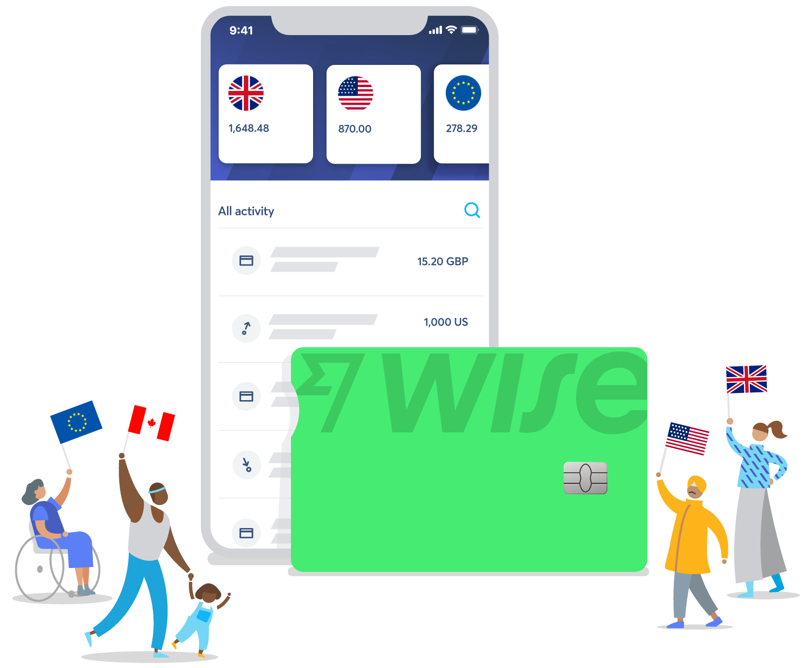
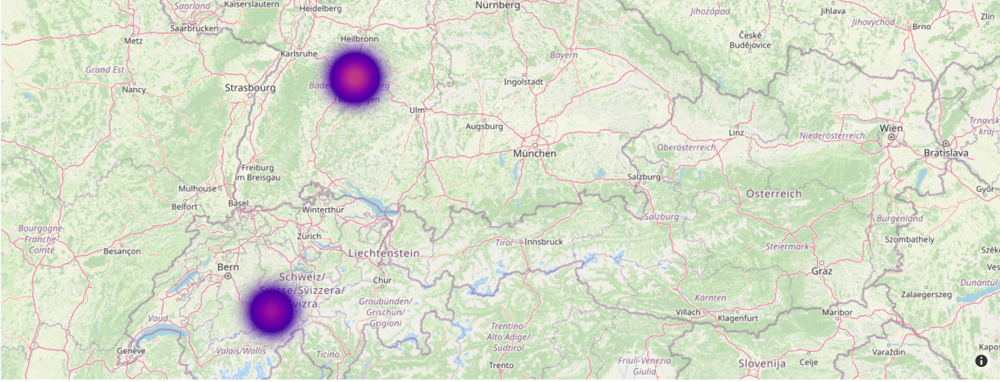
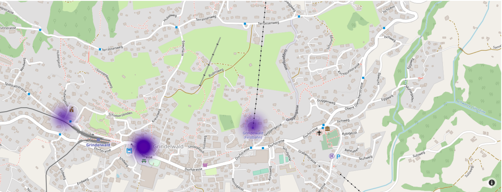

# Put your expenses on a map!

## About

Wise (former Transferwise) offers a debit card for its users. 

Let's put the transactions on a map for a better visual!

## Visual

## Usage

Get private.gem / public.gem from Wise website

Create token.ini (see example in token_example.ini)

$ python app.py